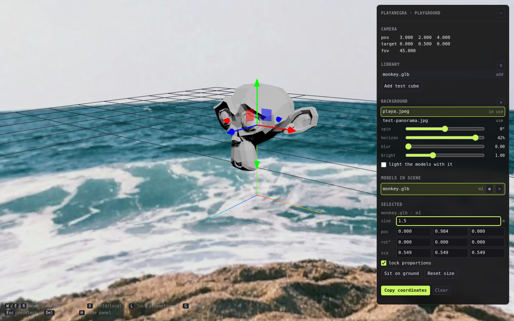

# constructor 3d

A browser playground for composing 3D scenes: add GLB models, move, rotate and resize
them until the arrangement works, then copy the exact coordinates out of the side panel
and paste them into the site that will use them.



## What it does

- **Add models** from `public/models/` or by dragging a `.glb` onto the canvas.
- **Move them** with a gizmo (`W` translate, `E` rotate, `R` scale) or by typing exact
  numbers into the panel. The two can never disagree — both read the same object.
- **Size them** in metres. The panel shows how big a model actually is, not just its
  scale factor, and keeps the proportions locked unless you say otherwise.
- **Set a backdrop**: any photo is wrapped around the scene as a panorama, with controls
  for spin, horizon, blur and brightness, and an option to light the models with it.
- **Copy coordinates** as a ready-to-paste TypeScript block: camera, backdrop and every
  model's transform.
- The scene is saved to `localStorage`, so a refresh does not throw away an afternoon of
  arranging.

## Running it

```
npm install
npm run dev      # http://localhost:5173
npm run build
npm run preview
```

Vite + vanilla TypeScript + three.js. No framework.

## Assets

There are three ways a file gets into the scene:

- **Drag it onto the canvas.** Works everywhere, including the deployed site. The file is
  read in your browser and never leaves it, so it is gone on reload and nobody else sees
  it. Good for a quick look.
- **Put it in `public/models/` or `public/backgrounds/`.** It appears in the panel without
  a restart and is bundled into the build. Both folders are git-ignored, since the files
  are large binaries — a fresh clone starts empty.
- **Upload it** with the ↑ button next to the library. The file goes to Vercel Blob and
  shows up, marked *shared*, for everyone who opens the site. This is the only route that
  is both permanent and visible to other people.

Uploading needs two things set on the deployment, and the button stays hidden until both
are there:

| | |
| --- | --- |
| A Blob store | Vercel dashboard → Storage → create a Blob store and connect it to the project. That sets `BLOB_READ_WRITE_TOKEN` for you. |
| `UPLOAD_PASSWORD` | An environment variable you choose. Anyone who has it can upload; without it set, uploads are refused outright rather than left open to the internet. |

The browser asks for that password on the first upload and remembers it. Uploads go
straight from the browser to Blob storage — the serverless function only checks the
password and hands back a token, so a 200 MB model is not squeezed through a request
body.

Locally, `/api` does not exist under `npm run dev`, so the upload buttons stay hidden and
the library shows whatever is in `public/`. Use `vercel dev` to exercise the real thing.

## Publishing

The site is deployed by Vercel on every push to `main`; the serverless functions in
`api/` come along with it.

`.github/workflows/deploy.yml` also publishes to GitHub Pages, which needs
**Settings → Pages → Source** set to *GitHub Actions*. Pages serves static files only, so
the upload buttons will not appear there — that build is the playground with whatever is
committed under `public/`.
